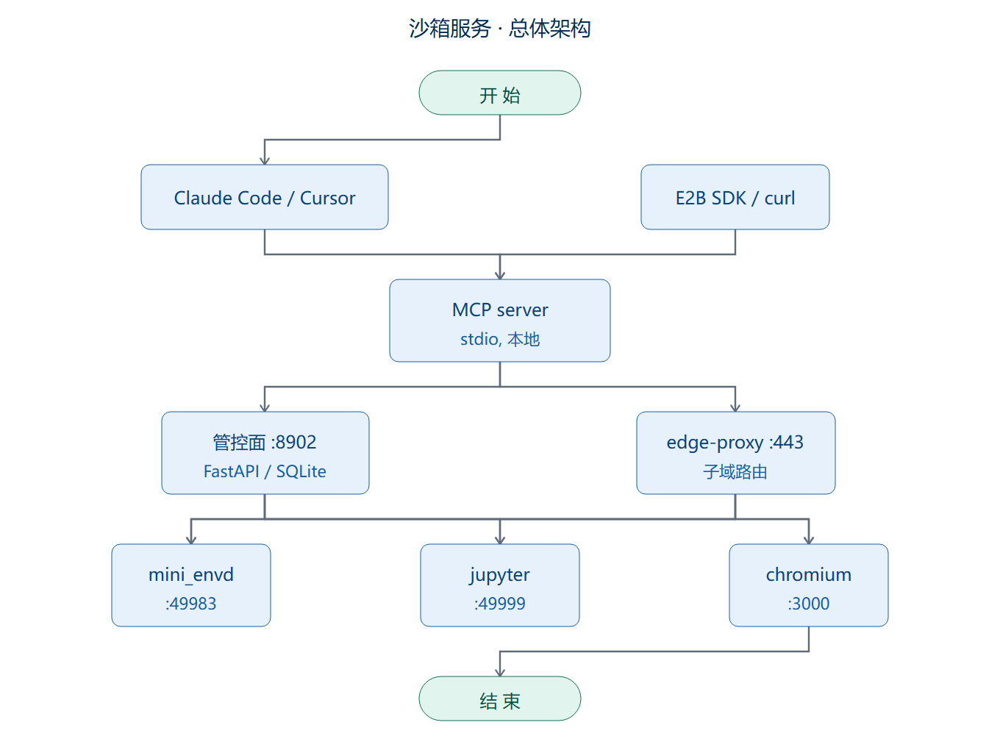
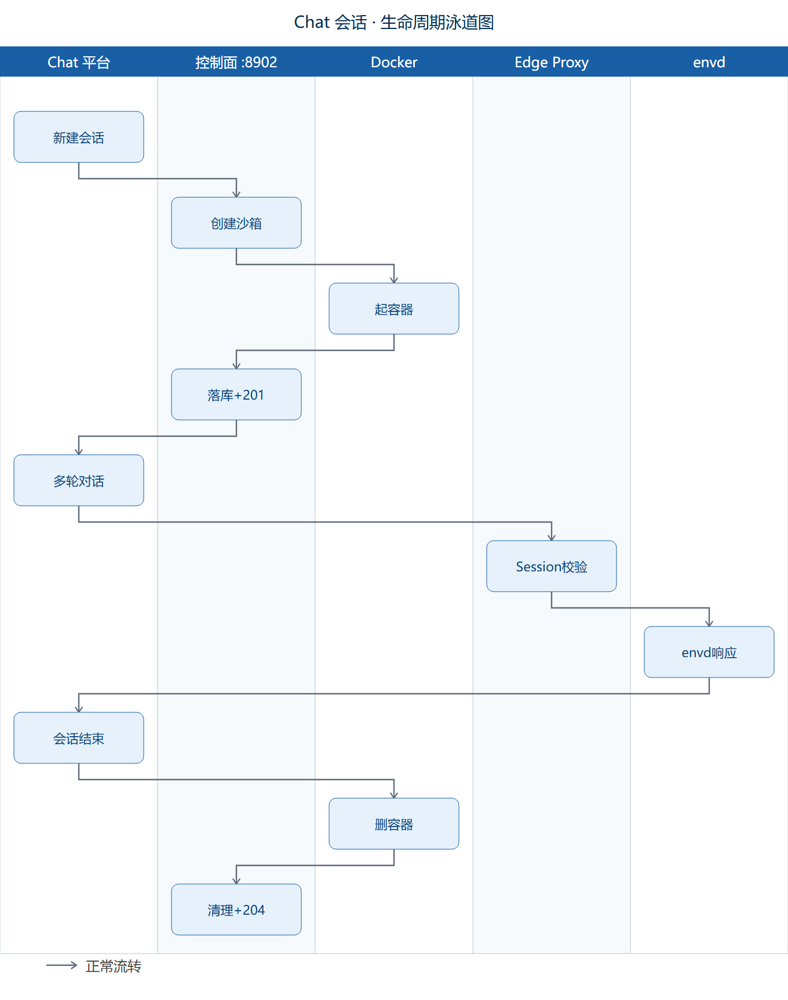
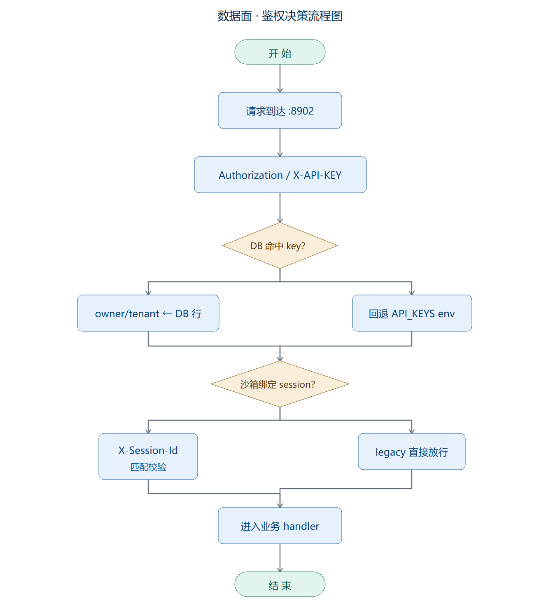
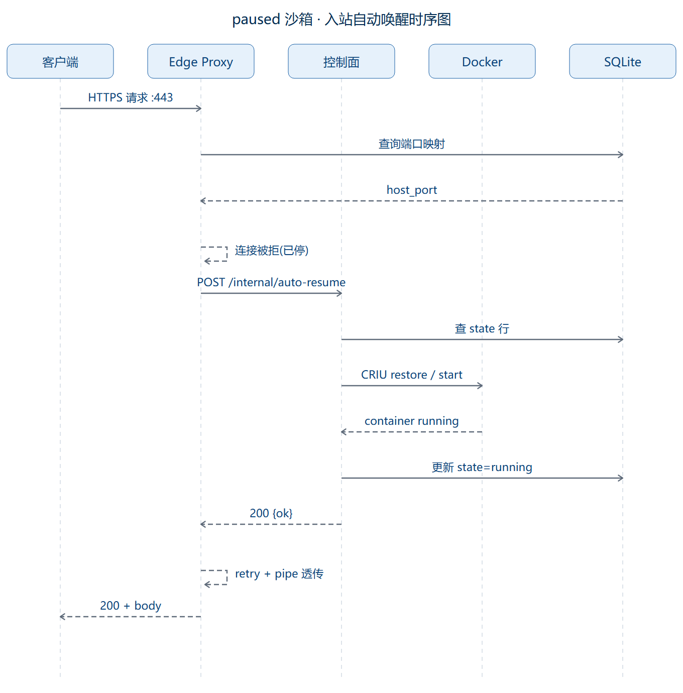
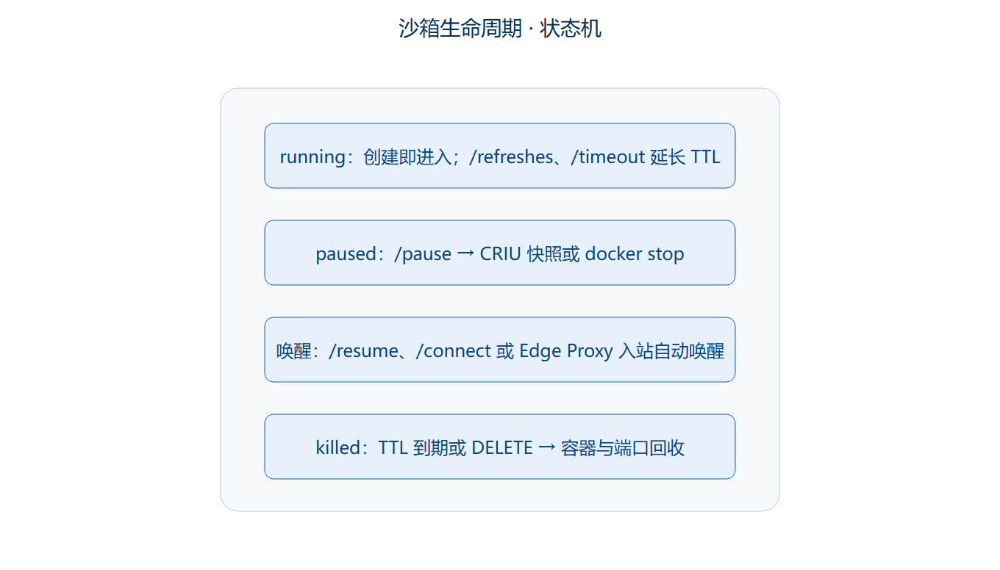
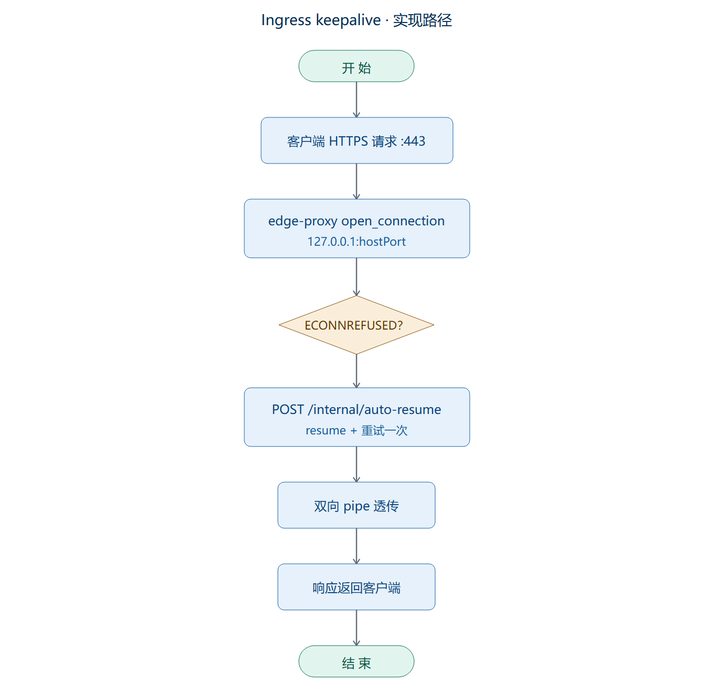

# zt-Sandbox — 自研云端沙箱服务（兼容 E2B 协议）

> 阿里百炼 Sandbox 的自研替代品，对外协议与 E2B 官方 SDK (`e2b==2.31.0`) 完全兼容。
> 一期代码解释器 + 二期浏览器 + 三期网络白名单 / CRIU / 并发调度，全部跑通。

**目标读者**：接手这个项目的 AI Agent / 人类开发者。读完这篇，你应该能：
1. 知道这套服务是什么、怎么部署、怎么用
2. 从你的 Agent 里直接调用沙箱 API
3. 知道哪些功能能用、哪些有坑、哪些是降级
4. 跑通所有冒烟测试
5. 在需要时定位问题

---

## 0. 速查

> 📖 **端点级参考**：每个 REST 端点的请求体/响应字段/错误码全部独立成册，见 [zt_sandbox_api_doc.md](zt_sandbox_api_doc.md)。本节及 §4 偏概念与场景，§3.4 给出调用流程图。

| 项 | 值 |
|---|---|
| 服务器 | `${SBX_SSH_HOST}`（内网 Linux，root / 123456） |
| 管控面 | `http://${SBX_SSH_HOST}:8902`（HTTP） |
| 边缘代理 | `https://*.{sandboxID}.${SBX_DOMAIN}`（TLS，自签 CA） |
| 管控面 API Key | `${SBX_API_KEY}`（REST 用，放 `Authorization: Bearer ...`） |
| SDK API Key | `${SBX_E2B_KEY}`（官方 e2b SDK 用，放 `X-API-KEY` 或 `api_key=`） |
| CA 证书（客户端） | 本机 `sandbox-service/certs/ca.pem`，部署脚本会自动下载 |
| 工作目录 | 本机 `E:\work\zt-Sandbox\sandbox-service` |
| 远程目录 | 服务器 `/srv/sandbox-service` |

**鉴权双通道**：管控面同时认 `Authorization: Bearer <key>` 和 `X-API-KEY: <key>` 两种 header。
官方 e2b SDK 只会发后者，所以两个都要支持。`API_KEYS` 环境变量是逗号分隔的列表，目前配的是 `${SBX_API_KEY},${SBX_E2B_KEY}`。

---

## 0.1 选哪种入口（决策树）

| 你的场景 | 推荐入口 | 章节 |
|---|---|---|
| Claude Code / Cursor 中让 Agent 直接跑代码 | **MCP**（stdio，`mcp_server.py`） | §4.7 |
| 已有 Python 代码、想用官方 SDK | **E2B SDK** | §4.1 |
| 已有 Node / Go / Java 代码、不想引 SDK | **REST + ConnectRPC JSON** | §4.6 方式 B |
| 想用 Playwright 跑浏览器 | **CDP 直连**（从 `webSocketDebuggerUrl`） | §4.3 方式 B |
| 只想批量执行、不想引入 SDK | **REST**（`Authorization: Bearer`） | §4.6 方式 B |

---

## 0.2 30 秒上手（Copy-Paste）

**A. 纯 REST（不依赖任何 SDK）**
```bash
curl -sS http://${SBX_SSH_HOST}:8902/health \
  -H "Authorization: Bearer ${SBX_API_KEY}" | jq

# 创建沙箱。templateID 可直接传模板名（"code-interpreter"）或 tmpl code，两者都解析
SID=$(curl -sS -X POST http://${SBX_SSH_HOST}:8902/sandboxes \
  -H "Authorization: Bearer ${SBX_API_KEY}" -H "Content-Type: application/json" \
  -d '{"templateID":"code-interpreter","timeout":600}' | jq -r .sandboxID)
echo "sandbox=$SID"

# 等就绪。总 .ok 按模板 features 聚合：code-interpreter 约 200ms；带 browser 的模板要等 Chromium 30-60s
for i in {1..60}; do
  curl -sS http://${SBX_SSH_HOST}:8902/sandboxes/$SID/health \
    -H "Authorization: Bearer ${SBX_API_KEY}" | jq -e '.ok' >/dev/null && break
  sleep 1
done

# 销毁
curl -sS -X DELETE http://${SBX_SSH_HOST}:8902/sandboxes/$SID \
  -H "Authorization: Bearer ${SBX_API_KEY}"
```

**B. Python（E2B 官方 SDK，零代码改动）**
```python
from e2b_code_interpreter import Sandbox
sbx = Sandbox.create(
    api_url=f"http://{SBX_SSH_HOST}:8902",
    api_key="${SBX_E2B_KEY}",   # 需 e2b_ 前缀
    domain="${SBX_DOMAIN}",      # 走 edge-proxy 子域路由
)
print(sbx.run_code("import sys; print(sys.version_info)").text)
sbx.kill()
```

**C. Claude Code / Cursor（MCP）**
把 §4.7.2 的 MCP 配置写入 `~/.claude/mcp_servers.json`（或项目 `.mcp.json`），重启 IDE，然后在对话里说 `用 zt-sandbox 跑 print(1+1)`。

---

## 1. 项目是什么

一句话：**给 AI 智能体用的隔离执行环境**。智能体要跑代码、要操作浏览器、要处理文件——都丢到这个沙箱里，跑完销毁，互不影响。

对标的产品是 [阿里百炼 Sandbox](https://bailian.console.aliyun.com/) 和 [E2B](https://e2b.dev/)。对外接口跟 E2B 的 Python SDK 完全兼容——意味着你**不改一行 SDK 代码**，把 `api_url` 指向我们的服务器就能跑：

```python
from e2b_code_interpreter import Sandbox
sbx = Sandbox.create(
    api_url="http://${SBX_SSH_HOST}:8902",
    api_key="${SBX_E2B_KEY}",
    domain="${SBX_DOMAIN}",
)
sbx.run_code("print(1+1)")
```

---

## 2. 架构



```
                          ┌────────────────────────────┐
   Claude Code/Cursor ───┤  MCP server (stdio, 本地)   │
   E2B SDK / curl    ─────┤                            │
                          └──────────┬─────────────────┘
                                     │
                ┌────────────────────┼────────────────────┐
                │ HTTP :8902 (管控)  │                    │
                ▼                    │                    │
   ┌────────────────────────┐        │                    │
   │  sandbox-control-plane │        │                    │
   │  FastAPI / SQLite     │        │                    │
   │  生命周期 / 模板 / 配额│        │                    │
   └──────────┬─────────────┘        │
              │ docker SDK            │ HTTPS :443 (子域路由)
              ▼                       ▼
   ┌─────────────────────────────────────────────────┐
   │           数据面（每沙箱一个容器, --network=host）│
   │  ┌──────────┐  ┌──────────┐  ┌──────────┐       │
   │  │ mini_envd│  │ jupyter  │  │ chromium │       │
   │  │  :49983  │  │  :49999  │  │  :3000   │       │
   │  └──────────┘  └──────────┘  └──────────┘       │
   └─────────────────────────────────────────────────┘
              ▲                       ▲
              │ HTTP                  │ HTTPS {port}-{sid}.${DOMAIN}
              └───────────────────────┘  (edge-proxy)
```

**三个入口，三条路径**：

| 入口 | 管控面 (`:8902`) | 数据面（容器端口） |
|---|---|---|
| **E2B SDK** | `X-API-KEY` 头，HTTPS 调 `:8902` 创建 | SDK 用 `envdAccessToken` 直连 envd :49983 |
| **REST / curl** | `Authorization: Bearer` 调 `:8902` | HTTPS 走 edge-proxy `:443`（`{port}-{sid}.${DOMAIN}`） |
| **MCP** | 同 REST，stdin/stdout 协议封装 | 同 REST，走 edge-proxy |

**关键设计决策**：

1. **管控面 / 数据面分离**：管控面只管创建/销毁/元数据；拿到 `host + token` 后你的 SDK **直接连容器**，管控面不做数据面代理。跟百炼 / E2B 一致。
2. **自研 mini_envd 替代 E2B 的 envd**：E2B 开源的 envd 是 Go 写的，我们不依赖它，用 Python + FastAPI 重写了相同的 ConnectRPC 接口（`/process.Process/...`、`/filesystem.Filesystem/...`、`/files`）。SDK 完全无感知。
3. **边缘代理按 host header 路由**：`https://3000-{sandboxID}.${SBX_DOMAIN}/...` → 查 SQLite 找 host 端口 → 转发到 `127.0.0.1:{hostPort}`。WebSocket 升级也支持（Playwright 通过 CDP 直连浏览器就靠它）。

---

## 3. 功能矩阵（当前状态）

| 功能 | 状态 | 备注 |
|---|---|---|
| 代码执行 (run_code) | ✅ 已交付 | Jupyter 内核，支持 stateful |
| 命令执行 (commands.run) | ✅ 已交付 | 后台 / 前台都支持 |
| 文件读写 (files.*) | ✅ 已交付 | read/write/list/make_dir/remove |
| 创建 / 列举 / 获取 / 释放沙箱 | ✅ 已交付 | E2B 协议对齐 |
| 暂停 / 恢复 (docker stop/start) | ✅ 已交付 | 文件系统保留，内存不保留 |
| **真 CRIU 暂停 / 恢复** | ✅ **已激活** | 需要 daemon 切到经典驱动（`fix_criu.py` 已处理） |
| 浏览器 (Chromium CDP) | ✅ 已交付 | 通过 Session API 或 Playwright 直连 |
| 多 session 并发浏览器 tab | ✅ 已交付 | 一个沙箱内最多 8 个 session |
| 网络白名单 (iptables) | ✅ 已交付 | 按域名 / CIDR 管控出口 |
| 并发调度 + 准入控制 | ✅ 已交付 | MAX_SANDBOXES=24, MAX_MEMORY_MB=6144 |
| TTL 超时回收 | ✅ 已交付 | 调度器每 15s 扫描 |
| 控制台 UI | ❌ 不支持 | 走 REST / SDK |

---

## 3.1 环境变量

**管控面容器**（`sandbox-control-plane`，写进 `deploy/docker-compose.yml` 或 `.env`）：

| 变量 | 必填 | 默认 | 说明 |
| --- | --- | --- | --- |
| `API_KEYS` | ✅ | 空 | 逗号分隔的 key 列表，至少填一个（推荐 `e2b_<随机>` 前缀） |
| `API_KEYS_JSON` | ❌ | 空 | **P4**：多租户身份绑定，详见 §4.13。JSON 数组 `[{key,owner,tenant}]`；留空则所有 key 视为 `(default,default)`，归属校验被关闭 |
| `SANDBOX_DOMAIN` | ❌ | `${SBX_SSH_HOST}.nip.io` | edge-proxy 子域路由用的公网域名 |
| `CRIU_ENABLED` | ❌ | `auto` | `auto` / `force` / `off`，CRIU 失败时是否降级 docker stop |
| `MAX_SANDBOXES` | ❌ | `24` | 全局最大并发沙箱数（429 配额满错误码） |
| `MAX_MEMORY_MB` | ❌ | `6144` | 全局内存配额（MB），所有沙箱 memoryMB 之和 |
| `CHECKPOINT_DIR` | ❌ | `/var/lib/sbx-checkpoints` | CRIU checkpoint 落盘目录 |
| `ADMIN_TOKEN` | ❌ | 空 | **P4**：`/admin/*` 管理面凭据，留空时 deploy 自动生成并打印一次，详见 §4.13.5 |
| `ADMIN_USER` / `ADMIN_PASSWORD` | ❌ | 空 | **P4**：管理面板登录凭据（= `SBX_SSH_USER` / `SBX_SSH_PASSWORD`，deploy 自动写入），详见 §4.13.7 |
| `ADMIN_SESSION_TTL_S` | ❌ | `28800` | **P4**：面板 session token 有效期（秒），默认 8 小时 |

**MCP server**（本地 Claude Code / Cursor 进程）：

| 变量 | 必填 | 说明 |
|---|---|---|
| `SBX_API_URL` | ✅ | 例：`http://192.168.2.162:8902` |
| `SBX_API_KEY` | ✅ | 管控面 key，对应 `Authorization: Bearer` |
| `SBX_DOMAIN` | ✅ | 边缘代理域名，例：`192.168.2.162.nip.io` |
| `SBX_CA_CERT` | ❌ | 自签 CA 证书绝对路径，推荐必填 |
| `SBX_INSECURE` | ❌ | `1` 关闭 TLS 校验，仅 dev |
| `SBX_HTTP_TIMEOUT` | ❌ | 默认 `120`（秒） |

---

## 3.2 端点清单（按能力分组）

> 详细的请求/响应字段、错误码、curl 示例全部在 [zt_sandbox_api_doc.md](zt_sandbox_api_doc.md)。本节只列能力分组 → 章节。

| 能力 | 端点族 | 详见手册 |
| --- | --- | --- |
| 模板管理 | `/v3/templates`、`/v2/templates`、`/templates/{code}`、`/templates/{code}/hooks` | §2 |
| 沙箱生命周期 | `/sandboxes`、`/sandboxes/{sid}[/health,/connect,/pause,/resume,/timeout,/refreshes]` | §3 |
| 网络策略 | `/sandboxes/{sid}/netpolicy[/refresh]` | §4 |
| 诊断与钩子 | `/sandboxes/{sid}/diag`、`/sandboxes/{sid}/hooks/status` | §5 |
| Admin Key 管理 | `/admin/keys`（GET/POST/DELETE） | §6 |
| 管理面板 | `/admin/login`、`/admin/sandboxes[/{sid}[/pause,/resume]]`、`/admin/ui`（静态） | README §4.13.7 |
| Chat-Session 隔离 | `sessionId` 字段 + `X-Session-Id` 头 | §7 |
| 数据面（容器内 envd） | `/health`、`/files`、`/process.Process/*`、`/filesystem.Filesystem/*` | §8 |

数据面（每沙箱独占 3 端口）：

| 端口标签 | 协议 | 用途 | edge-proxy 子域 |
| --- | --- | --- | --- |
| 49983 | ConnectRPC JSON + `/files` | envd 文件 / 进程 | `https://49983-{sid}.${DOMAIN}` |
| 49999 | Jupyter kernel | run_code | `https://49999-{sid}.${DOMAIN}` |
| 3000 | HTTP + WS | Chromium CDP | `https://3000-{sid}.${DOMAIN}` |

鉴权速记：

- 数据面 `Authorization: Bearer ${API_KEY}` 或 `X-API-KEY: ${API_KEY}`（SDK 用后者）
- 管理面 `X-Admin-Token: ${ADMIN_TOKEN}` 或面板登录签发的 `sbxsess.*` session token（仅 `/admin/*` 接受）
- 数据面（容器内） `x-access-token: ${envdAccessToken}` + 可选 `X-Session-Id: ${sessionId}`
- 三个凭据互不替换

---

## 3.3 错误码速记

响应统一 `{code, message, requestID}`。完整对照见 [zt_sandbox_api_doc.md §9](zt_sandbox_api_doc.md)。

| 类别 | code 段 | HTTP |
| --- | --- | --- |
| 鉴权 / 身份 | `100001` 缺 key / `100011` 跨 owner-tenant / `100012` admin 失败 / `100013` session 失败 | 401 / 403 / 503 |
| 资源 | `100002` 模板 / `100003` 沙箱 / `100014` key 不存在 | 404 |
| 参数 | `100004` 缺字段 / `100008` 解析错 | 400 |
| 生命周期 | `100005` 启动 / `100006` 恢复 / `100010` hook 失败 | 500 / 503 |
| 冲突 | `100007` 模板有依赖 / `100015` session 已占 | 409 |
| 配额 | `100009` 数量/内存超限 | 429 |

---

## 3.4 调用逻辑图

下面四张图给出常见路径的"为什么这么调"。读端点字段请回到手册；这里关注流程。

### 3.4.1 一次 Chat 会话的完整生命周期（泳道图）

5 条泳道：`Chat 平台` = 调用方后端；`控制面` = `:8902`；`Edge Proxy` = `:443` TLS 转发；`envd` = 容器内守护；`Docker` = 宿主机 daemon。SQLite 读写归入控制面泳道。



关键细节：`POST /sandboxes` 携带 `sessionId` → 控制面查重（同 owner/tenant/session 已有 running 则 409）→ 起容器 → 落库带 `session_id` → 返回 201。多轮对话经 `https://49983-{sid}.{domain}/...` 访问，Edge Proxy 解析子域后查 DB 校验 `X-Session-Id` 再转发 envd。`DELETE` 时删容器、删行、释放端口，返回 204。

### 3.4.2 数据面鉴权决策（流程图）

下图为**数据面主链**。两条旁路链：`/admin/*` 需 `X-Admin-Token` 匹配（未配 `ADMIN_TOKEN` → 503，不匹配 → 401，错误码 100012）；`/health`、`/metrics`、`/internal/*` 无鉴权直通。失败分支：两侧均无 key → 401（100001）；`X-Session-Id` 缺失或不匹配 → 403（100013）。



### 3.4.3 paused 沙箱被入站请求自动唤醒（P3 keepalive 时序图）



> 客户端无感：不需要先 `POST /resume` 再用；第一次连接慢约 1-3 s（CRIU 还原），之后毫秒级。

### 3.4.4 沙箱生命周期状态机



> `killed` 不是 DB 中的实际状态值 — 行被直接 `DELETE`；这里画图表示端口/容器都回收了。

---

## 4. 给 Agent 的实战手册

### 4.1 创建沙箱 + 跑代码

```python
from e2b_code_interpreter import Sandbox

sbx = Sandbox.create(
    api_url="http://${SBX_SSH_HOST}:8902",
    api_key="${SBX_E2B_KEY}",
    domain="${SBX_DOMAIN}",
    timeout=600,  # 秒
)
print(sbx.sandbox_id)

# 跑 Python
res = sbx.run_code("import sys; print(sys.version)")
print(res.text)
print(res.logs.stdout)

# 跑 shell
out = sbx.commands.run("echo hello && ls /home/user")
print(out.stdout, out.exit_code)

# 文件操作
sbx.files.write("/home/user/workspace/data.json", '{"a": 1}')
content = sbx.files.read("/home/user/workspace/data.json")
entries = sbx.files.list("/home/user/workspace")

# 销毁
sbx.kill()
```

### 4.2 暂停 / 恢复（保留内存的真 CRIU）

```python
from e2b import Sandbox

sbx = Sandbox.create(...)
sbx.commands.run("echo first")

# 暂停（默认走 CRIU，如果不可用会自动降级到 docker stop）
sbx.beta_pause(api_url=..., api_key=..., headers={"Authorization": "Bearer ${SBX_API_KEY}"})

# 恢复
Sandbox._cls_resume(sandbox_id=sbx.sandbox_id, ...)
sbx2 = Sandbox.connect(sandbox_id=sbx.sandbox_id, ...)

# 检查用了哪种模式
info = httpx.get(f"http://${SBX_SSH_HOST}:8902/sandboxes/{sbx.sandbox_id}",
                 headers={"Authorization": "Bearer ${SBX_API_KEY}"}).json()
print(info["pauseMode"])  # "criu" 或 "stop"
```

**关键区别**：
- `pauseMode: "criu"` → 内存状态保留（进程、变量、打开的文件描述符都在）
- `pauseMode: "stop"` → 只保留文件系统，内存里的东西（比如 Jupyter kernel 的变量）会丢

### 4.3 浏览器操作

**方式 A：用我们封装的 Session API（推荐）**

不需要装 Playwright。直接 HTTP 调用：

```python
import httpx

API = "http://${SBX_SSH_HOST}:8902"
KEY = "${SBX_API_KEY}"
DOMAIN = "${SBX_DOMAIN}"
H = {"Authorization": f"Bearer {KEY}", "Content-Type": "application/json"}

# 1. 创建带浏览器的沙箱
tpl = next(t for t in httpx.get(f"{API}/v2/templates", headers=H).json()
           if t.get("browserEnabled"))
sbx = httpx.post(f"{API}/sandboxes", headers=H,
                 json={"templateID": tpl["templateCode"], "timeout": 900}).json()
sid = sbx["sandboxID"]
token = sbx["envdAccessToken"]

# 2. 等浏览器就绪
import time
for _ in range(60):
    h = httpx.get(f"{API}/sandboxes/{sid}/health", headers=H).json()
    if h.get("ok"): break
    time.sleep(2)

# 3. 用 Session API
B = f"https://3000-{sid}.{DOMAIN}"
bh = {"X-Access-Token": token, "Content-Type": "application/json"}

session_id = httpx.post(f"{B}/session/create", headers=bh,
                        json={"viewport": {"width": 1280, "height": 800}}).json()["sessionId"]

# 批量动作（goto / fill / click / evaluate / screenshot / cookies / console ...）
r = httpx.post(f"{B}/session/{session_id}/act", headers=bh, json={
    "actions": [
        {"type": "goto", "url": "https://example.com", "waitUntil": "load"},
        {"type": "title"},
        {"type": "screenshot"},
    ]
}).json()
print(r["results"])

# 取 PNG
png = httpx.get(f"{B}/session/{session_id}/screenshot", headers=bh).content

# 取内容（title/url/html/text）
content = httpx.get(f"{B}/session/{session_id}/content", headers=bh).json()

# 取 PDF
pdf = httpx.get(f"{B}/session/{session_id}/pdf", headers=bh).content

# 关闭
httpx.post(f"{B}/session/{session_id}/close", headers=bh)
httpx.delete(f"{API}/sandboxes/{sid}", headers=H)
```

**方式 B：Playwright 直连 CDP**

如果你已经有 Playwright 代码，直接 `connect_over_cdp`：

```python
from playwright.sync_api import sync_playwright

# 先拿到 webSocketDebuggerUrl
ws = httpx.get(f"https://3000-{sid}.{DOMAIN}/json/version").json()["webSocketDebuggerUrl"]

with sync_playwright() as p:
    browser = p.chromium.connect_over_cdp(ws)
    page = browser.contexts[0].new_page()
    page.goto("https://example.com")
    print(page.title())
    page.screenshot(path="shot.png")
    browser.close()
```

**注意**：Playwright 的 node driver 会吃你机器上的 HTTP 代理环境变量，测试前一定要清掉：
```python
for k in ("HTTP_PROXY","HTTPS_PROXY","http_proxy","https_proxy","ALL_PROXY","all_proxy"):
    os.environ.pop(k, None)
os.environ["NO_PROXY"] = "*"; os.environ["no_proxy"] = "*"
os.environ["NODE_EXTRA_CA_CERTS"] = "/path/to/certs/ca.pem"
```

### 4.4 网络白名单

创建模版时指定 `networkPolicy`：

```python
httpx.post(f"{API}/v3/templates", headers=H, json={
    "name": "restricted",
    "image": "sandbox/code-interpreter:v1",
    "cpuCount": 1, "memoryMB": 1024,
    "networkPolicy": {
        "mode": "allowlist",
        "domains": ["pypi.tuna.tsinghua.edu.cn", "files.pythonhosted.org"],
        "cidrs": []
    }
})
```

实现原理：管控面（跑在 `network_mode: host`）按容器源 IP 在 `DOCKER-USER` 链挂专属链 `SBX_<id>`，白名单外的流量直接 DROP。

P3 起支持**通配符域名**（`*.example.com`）+ **CDN 切换自动跟随**：详见 §4.10。

### 4.5 检查系统健康

```python
cap = httpx.get(f"{API}/health", headers=H).json()
# {
#   "ok": true,
#   "criu": true,            ← CRIU 是否可用
#   "netpolicy": true,       ← iptables 是否可用
#   "capacity": {"max": 24, "used": 3, "cpu": 2, "memoryMB": 2048}
# }
```

---

### 4.6 获取沙箱产出物（文件下载）

> 端点请求体与 ConnectRPC 方法签名见 [zt_sandbox_api_doc.md §8](zt_sandbox_api_doc.md)。本节只讲"怎么把文件拿出来"的三种姿势。

代码跑完后，生成在沙箱里的文件怎么拿回来：

**方式 A：用 E2B SDK（最方便）**

```python
from e2b_code_interpreter import Sandbox
sbx = Sandbox.create(api_url="http://${SBX_SSH_HOST}:8902",
                     api_key="${SBX_E2B_KEY}", domain="${SBX_DOMAIN}")

# 读文件（返回字符串）
content = sbx.files.read("/home/user/workspace/output.csv")

# 列出目录
entries = sbx.files.list("/home/user/workspace")
for e in entries:
    print(f"{e.name}  {e.type}  {e.path}")

# 通过命令查看
out = sbx.commands.run("cat /home/user/workspace/output.csv")
print(out.stdout)

sbx.kill()
```

**方式 B：纯 HTTP（不依赖 SDK）**

```python
import httpx
API = "http://${SBX_SSH_HOST}:8902"
DOMAIN = "${SBX_DOMAIN}"
H = {"Authorization": "Bearer ${SBX_API_KEY}"}

# 创建沙箱
sbx = httpx.post(f"{API}/sandboxes", headers=H,
                 json={"templateID": "<tmplID>", "timeout": 600}).json()
sid, token = sbx["sandboxID"], sbx["envdAccessToken"]
bh = {"X-Access-Token": token}

# 读文件
content = httpx.get(f"https://49983-{sid}.{DOMAIN}/files",
                    params={"path": "/home/user/workspace/output.csv"},
                    headers=bh, verify="certs/ca.pem").content

# 上传文件
httpx.post(f"https://49983-{sid}.{DOMAIN}/files",
           params={"path": "/home/user/workspace/input.json"},
           headers=bh, content=b'{"key":"value"}', verify="certs/ca.pem")

# 目录列表
r = httpx.post(f"https://49983-{sid}.{DOMAIN}/filesystem.Filesystem/ListDir",
               json={"path": "/home/user/workspace"},
               headers={**bh, "Content-Type": "application/connect+json"},
               verify="certs/ca.pem")

httpx.delete(f"{API}/sandboxes/{sid}", headers=H)
```

**方式 C：运维提取（沙箱还活着时）**

```bash
ssh root@${SBX_SSH_HOST}
docker cp sbx-{sandboxID}:/home/user/workspace/output.csv ./output.csv
```

**鉴权注意**：文件 API 需要 `X-Access-Token`（创建沙箱响应里的 `envdAccessToken`），每个沙箱随机生成。

---

### 4.7 让 Claude Code / Cursor 直接驱动沙箱（**MCP 集成**）

> 🆕 P3 引入。装一次 MCP 配置，Claude Code 就能在对话里直接 `create_sandbox`、`run_code`、`files_read`，**零代码接入**。

#### 4.7.1 安装依赖

在**本地机器**（Claude Code / Cursor 运行的地方），一次性装好 MCP SDK：

```bash
pip install -r sandbox-service/server/requirements-mcp.txt
```

#### 4.7.2 配置 MCP host

**Claude Code**（`~/.claude/mcp_servers.json` 或项目级 `.mcp.json`）：

```json
{
  "mcpServers": {
    "zt-sandbox": {
      "command": "python",
      "args": ["e:/work/zt-Sandbox/sandbox-service/server/mcp_server.py"],
      "env": {
        "SBX_API_URL": "http://${SBX_SSH_HOST}:8902",
        "SBX_API_KEY": "${SBX_API_KEY}",
        "SBX_DOMAIN": "${SBX_DOMAIN}",
        "SBX_CA_CERT": "e:/work/zt-Sandbox/sandbox-service/certs/ca.pem"
      }
    }
  }
}
```

> 端口/密钥占位符请替换为实际值（见 §0 速查）。`SBX_CA_CERT` 指向自签 CA；如果懒得管，加 `"SBX_INSECURE": "1"` 走明文校验（仅 dev）。

#### 4.7.3 可用 tools（12 个）

| 分类 | Tool | 说明 |
|---|---|---|
| 模板 | `list_templates` | 列出可用模板 |
| 生命周期 | `create_sandbox` | 创建实例（返回 sandbox_id） |
| 生命周期 | `list_sandboxes` / `get_sandbox` | 列表 / 详情 |
| 生命周期 | `kill_sandbox` | 销毁 |
| 生命周期 | `pause_sandbox` / `resume_sandbox` | 暂停（CRIU 保留内存）/ 恢复 |
| 计算 | `run_code` | Jupyter 内核执行 Python（stateful） |
| 计算 | `run_command` | 前台 shell 命令 |
| 文件 | `files_read` / `files_write` / `files_list` | 读 / 写 / 列目录 |

#### 4.7.4 在 Claude Code 里使用

```text
> 用 zt-sandbox 创建一个 Python 沙箱，跑 "import numpy as np; print(np.__version__)"
  → Claude 调用 create_sandbox → run_code → kill_sandbox，整个流程自动完成

> 在那个沙箱里写一个 requirements.txt，pip install requests，然后跑一段请求 https://httpbin.org/ip 的代码
  → Claude 链式调用 create_sandbox → files_write → run_code（多次）→ kill_sandbox

> 暂停这个沙箱，10 秒后恢复，验证 x = 41 还在
  → Claude 调用 pause → 等待 → resume → run_code 验证
```

#### 4.7.5 数据面调用路径

MCP server 不直接连沙箱容器，而是走 **edge-proxy HTTPS 子域路由**（与 e2b SDK 一致）：

```text
MCP server  ──HTTP──▶  control plane :8902   (lifecycle, 元数据)
            ──HTTPS─▶  edge-proxy :443
                          │
                          ▼  subdomain 路由
                  https://{port}-{sandboxID}.{DOMAIN}
                  ├─ 49983 → envd      (files, process)
                  ├─ 49999 → jupyter   (run_code)
                  └─ 3000  → browser   (CDP, screenshot)
```

好处：MCP server 部署在哪都能用，不需要直接连通宿主机 20000+ 端口。

#### 4.7.6 端到端冒烟

```bash
# 在本机跑，需要 SBX_API_URL / SBX_API_KEY / SBX_DOMAIN 三个环境变量
python sandbox-service/tests/mcp_smoke.py
```

会跑完 8 步完整流程：list_templates → create_sandbox → list/get → files 读写 → run_code (stateful) → run_command → pause/resume → kill，验证 Jupyter 变量在 pause/resume 后仍保留。

#### 4.7.7 MCP 排错清单

| 症状 | 检查 |
| --- | --- |
| MCP 启动报 `SBX_API_KEY env var is required` | 配置里 `env.SBX_API_KEY` 是否设了，注意**不要**用 `${}` 占位（除非 IDE 支持 shell 变量展开） |
| MCP 启动报 `SBX_DOMAIN env var is required` | 同上，必须填 `${SBX_DOMAIN}` 实值（不能空） |
| Tool 调用全 401 | `SBX_API_KEY` 不在 `API_KEYS` 列表里 → 服务器侧加 |
| Tool 调用全 SSL 错 | 没配 `SBX_CA_CERT` 且未开 `SBX_INSECURE=1` |
| `run_code` 超时 | 默认 `SBX_HTTP_TIMEOUT=120`；长任务调大或拆段 |
| 文件读出来是乱码 | 大文件用 `run_command: cat` 或 `docker cp`，`files_read` 走 JSON 字符串 |
| 创建沙箱 429 | 配额满 → 让 Claude 先调 `list_sandboxes` 把旧的 `kill` 掉 |

---

### 4.8 生命周期钩子 + watchdog（OSEP-0020 风格）

> 🆕 P3 引入。模板可以挂 **startup 钩子**（创建后顺序执行，失败可 fail-closed 整盘回滚）和 **periodic 钩子**（按 `interval_s` 节拍重跑）。

#### 4.8.1 钩子结构

```json
{
  "name": "marker",
  "command": "mkdir -p /tmp/hook && touch /tmp/hook/ok",
  "cwd": "/var/log",
  "env": {"FOO": "bar"},
  "timeout_s": 30,
  "fail_closed": true,
  "interval_s": 60          // 仅 periodic 用：两次执行至少间隔这么多秒
}
```

| 字段 | 适用 | 默认 | 说明 |
| --- | --- | --- | --- |
| `name` | 全部 | `"?"` | 用于查日志和 hook_state 索引 |
| `command` | 全部 | **必填** | 通过 `/bin/sh -c` 在容器内 `docker exec` 执行 |
| `cwd` / `env` | 全部 | `null` | 可选 |
| `timeout_s` | 全部 | 60 | watchdog 墙钟超时；超时返回 error 但**不杀进程**（需要硬杀请自己在 command 里加 `timeout`） |
| `fail_closed` | startup | `true` | 失败时是否阻塞沙箱发布；`false` 时仅记录，仍继续后续钩子 |
| `interval_s` | periodic | 60 | 两次执行最少间隔多少秒 |

#### 4.8.2 创建带钩子的模板

```bash
curl -X POST http://${SBX_DOMAIN}:8902/v3/templates \
  -H "Authorization: Bearer ${SBX_API_KEYS}" \
  -H "Content-Type: application/json" \
  -d '{
    "name": "with-hooks",
    "image": "sandbox/code-interpreter:v1",
    "cpuCount": 1, "memoryMB": 1024, "diskSizeMB": 1024,
    "startupHooks": [
      {"name": "warm-cache", "command": "mkdir -p /home/user/workspace && ls /home/user/workspace", "timeout_s": 10},
      {"name": "block-if-broken", "command": "exit 0", "fail_closed": true}
    ],
    "periodicHooks": [
      {"name": "tick", "command": "echo $(date -Iseconds) >> /tmp/tick.log", "interval_s": 30}
    ]
  }'
```

#### 4.8.3 单独改钩子（不重建模板）

```bash
# 查
curl -s -H "Authorization: Bearer ${SBX_API_KEYS}" \
  http://${SBX_DOMAIN}:8902/templates/${TMPL_CODE}/hooks | jq

# 改：startupHooks / periodicHooks 至少传一个，未传的保持不变
curl -X PUT -H "Authorization: Bearer ${SBX_API_KEYS}" \
  -H "Content-Type: application/json" \
  -d '{"periodicHooks": [{"name":"tick","command":"echo OK","interval_s":15}]}' \
  http://${SBX_DOMAIN}:8902/templates/${TMPL_CODE}/hooks
```

#### 4.8.4 看执行历史

```bash
curl -s -H "Authorization: Bearer ${SBX_API_KEYS}" \
  http://${SBX_DOMAIN}:8902/sandboxes/${SBX_ID}/hooks/status | jq
```

返回示例：
```json
{
  "sandboxID": "sbx...",
  "configuredStartupHooks": [{"name": "warm-cache", ...}],
  "configuredPeriodicHooks": [{"name": "tick", "interval_s": 30}],
  "hookState": {
    "startup": {
      "ran_at": 1730000000.12,
      "all_passed": true,
      "blocking_failures": [],
      "results": [{"name": "warm-cache", "ok": true, "exit_code": 0, "elapsed_s": 0.04, "stdout": "...", "stderr": ""}]
    },
    "periodic": {
      "last_tick": 1730000030.5,
      "hooks": {
        "tick": {"last_run": 1730000030.5, "last_ok": true, "last_error": "", "elapsed_s": 0.01}
      }
    }
  }
}
```

#### 4.8.5 失败语义

| 场景 | 结果 |
|---|---|
| startup hook 超时 | 单条记录 `ok=false, error="timeout after 30s"`，不影响后续（除非 fail_closed） |
| startup hook 任意一条 `fail_closed=true` 失败 | **整盘回滚**：容器销毁 + 元数据删除 + `POST /sandboxes` 返回 **500 `启动钩子失败: [...]`** |
| startup hook `fail_closed=false` 失败 | 记录在 `hook_state.startup.results`，`all_passed=true`，沙箱正常发布 |
| periodic hook 失败 | 仅记日志 + 更新 `last_ok=false` / `last_error`，**不杀沙箱**（best-effort） |

#### 4.8.6 端到端冒烟

```bash
python sandbox-service/tests/hook_smoke.py
```

跑 5 项：PUT hooks round-trip → startup 成功 → startup fail-closed 回滚 → startup 非阻塞失败容忍 → periodic 触发验证。

---

### 4.9 Ingress on-demand keepalive

> 🆕 P3 引入。**用户视角**：暂停的沙箱对端来说"永远在线"——任何 HTTPS 请求过来都会自动触发唤醒，**不需要显式调 `/connect`**。

#### 4.9.1 行为对比

| 场景 | 没有 keepalive | 有了 keepalive |
|---|---|---|
| 用户在浏览器打开 paused sandbox URL | `ERR_CONNECTION_REFUSED` | 第一次请求 ~1.5s 后页面正常加载（用户无感） |
| 用户 curl paused sandbox 的 envd | `curl: (7) Failed to connect` | curl 拿到 200 |
| WebSocket / CDP | 连接失败 | 自动恢复 + 转发 |
| 后续请求 | 都失败 | 走 fast path（容器已 running） |

实现路径只有 ~10 行：



```text
client ──HTTPS──▶ edge proxy ──open_connection──▶ sandbox host_port
                                        │
                                        └── ECONNREFUSED?
                                                │
                                                ▼
                                  POST /internal/auto-resume
                                                │
                                                ▼
                                  resume sandbox, retry once
```

#### 4.9.2 端点

```bash
# 内部端点（不走 API Key 鉴权，因为只有边缘代理会调）
curl -X POST "http://127.0.0.1:8902/internal/auto-resume?sandbox=$SID&port=$PORT"
# → 200 {"ok":true}                     # 唤醒成功
# → 200 {"ok":true,"alreadyRunning":true} # running 沙箱直接 no-op
# → 404 sandbox not found                # 不存在
# → 409 cannot auto-resume              # 状态非 paused
# → 503 resume failed                   # 容器存在但 _resume_data_plane 失败
```

#### 4.9.3 失败模式

| 触发 | 结果 |
| --- | --- |
| paused 沙箱 → /internal/auto-resume | 同步 resume + 等 envd 就绪；返回 200 |
| running 沙箱 → /internal/auto-resume | no-op，秒回 `{alreadyRunning:true}`（proxy 第一次重试用） |
| 唤醒后 sandbox 仍无法 listen port | 503，proxy 透传给客户端 |
| sandbox row 不存在 | 404（这种情况一般不会出现，因为 proxy 先解析 host header） |

#### 4.9.4 端到端冒烟

```bash
python sandbox-service/tests/keepalive_smoke.py
```

跑 4 项：running 可达 → paused 唤醒（~1.7s wake vs 0.01s fast path）→ 二次唤醒循环 → `/internal/auto-resume` 幂等。

> **⚠️ 运行前提**：因为 Windows 开发机出站 443 受限，这个 smoke 必须在 **Linux server** 上跑（已通过 `sftp` 上传到 `/srv/sandbox-service/tests/keepalive_smoke.py`）。
> 或者从任何能解析 `*.${SBX_DOMAIN}` + 连得上 server:443 的机器跑。

### 4.10 Egress FQDN allowlist（通配符 + CDN 切换）

> 🆕 P3 引入。在 P2 IP/CIDR + 单域名白名单的基础上加两件事：**通配符域名** `*.example.com`、**周期性重解析**（CDN 切换 IP 后自动跟随）。

#### 4.10.1 语法

| 写法 | 含义 |
|---|---|
| `example.com` | 精确匹配，只解析 apex |
| `*.example.com` | 通配，展开为 apex + `www/api/cdn/static/assets/chat` 六个常用前缀（都解析） |
| `10.0.0.0/8` | CIDR 字面量，原样写入 iptables `-d` 规则 |

> **为什么展开固定前缀而不是枚举所有子域？** 没权威方法列出 `*.example.com` 下所有域名。固定前缀覆盖 90% 实际场景，其余子域通常共享 apex 的 CDN 边缘 IP，apex 规则已经够用。

#### 4.10.2 手动 / 自动刷新

```bash
# 手动：每次会 flush+重建当前 SBX_<id> 链
curl -X POST "http://127.0.0.1:8902/sandboxes/$SID/netpolicy/refresh"
# → {"sandboxID":"...","refreshedAt":<unix_ts>,"allowed":[...],"resolved":{...}}
# → 200 {"skipped":true,...}       # open mode / 已销毁的沙箱

# 自动：管控面后台每 5min 跑一次（覆盖所有 allowlist 模式的活跃沙箱）
# 调 NETPOLICY_REFRESH_S=<秒> 改周期
```

CDN 切换场景：原 IP 被回收 / 新 IP 上线 → 下一次 refresh 把新 IP 写进 iptables，沙箱侧无感。

#### 4.10.3 实现细节

- 解析走 `socket.getaddrinfo`；**只保留 IPv4**（iptables-nft 在本部署环境拒绝 IPv6 target，会刷一堆 warning）。
- chain 名 `SBX_<id-last10>`（iptables 链名 ≤ 28 字符限制）。
- 状态保存在管控面进程内的 `_state[sandbox_id]`，重启会丢失（重启后第一次 refresh 会按"已无状态"跳过，沙箱侧旧规则仍在；如需重启后立刻对齐，需要重建沙箱或重新 POST `/netpolicy`）。
- `127.0.0.1` 的 host-network 沙箱**不自动**应用 netpolicy（所有沙箱共享回环，iptables 无意义）；但可以走 `POST /sandboxes/{id}/netpolicy` 手动装——见 fqdn smoke 就是这么验证的。

#### 4.10.4 端到端冒烟

```bash
python sandbox-service/tests/fqdn_smoke.py
```

跑 3 项：

1. **wildcard 展开**：`*.openai.com` + `*.anthropic.com` → apex + `www/api/cdn/...` 都在 `resolved` 里
2. **手动 refresh**：`refreshedAt` 推进、`resolved` 返回新 IP
3. **精确模式不展开**：`example.com` 不会自动塞进 `www.example.com`

### 4.11 Diagnostic API（沙箱侧点查）

> 🆕 P3 引入。给 Agent / 运维一组**只读**端点，一次 round-trip 拿到单个沙箱的全部关键调试状态（容器进程、资源、日志、连接、envd 健康）。

#### 4.11.1 端点

```bash
# 全部 5 个 section（默认）
GET /sandboxes/{id}/diag

# 选 section + 调日志行数
GET /sandboxes/{id}/diag?include=processes,stats,envd&logTail=200

# 404 if sandbox row missing
```

#### 4.11.2 返回结构

```jsonc
{
  "sandboxID": "sbx...",
  "container": {
    "id": "abc123...",      // Docker ID 前 12 位
    "name": "sbx-...",
    "image": "sandbox/code-interpreter:v1",
    "status": "running",
    "created": "2026-09-29T...",
    "networkMode": "host",  // "host" 或 "bridge"
    "ipAddress": "127.0.0.1"  // host-network 沙箱固定 127.0.0.1
  },
  "processes":  { "count": N, "list": [{"pid":1,"user":"root","time":"00:00","cmd":"/init"}, ...] },
  "stats": {
    "cpuPct": 0.5,            // null 表示容器刚起 / precpu 缺失
    "memUsageBytes": 12345678,
    "memLimitBytes": 2147483648,
    "memPct": 0.57,
    "netRxBytes": 1024,
    "netTxBytes": 2048,
    "blockReadBytes": 0,
    "blockWriteBytes": 4096,
    "ts": 1790652443.36
  },
  "logs": {
    "stdout": "...",         // 最近 N 行（默认 100）
    "stderr": "...",
    "linesShown": 100,
    "truncated": true        // Docker tail 不知道总数,总假设截断
  },
  "connections": {
    "count": N,               // 容器内 tcp 监听 / 连接数
    "list": [{"proto":"tcp","local":"0.0.0.0:20000","remote":"0.0.0.0:0","state":"LISTEN","pid":null,"cmd":null}, ...],
    "source": "proc/net"      // 数据来源: "ss/netstat" 或 "proc/net" (容器无 ss 时 fallback 到 /proc/net/tcp)
  },
  "envd": {
    "reachable": true,
    "statusCode": 200,
    "latencyMs": 12.4,
    "raw": {"ok": true}       // envd /health 的原始 JSON
  },
  "ts": 1790652443.36
}
```

#### 4.11.3 设计取舍

- **5 个 section 独立失败**：容器 paused / exited 时 `top()` 和 `stats()` 会失败，但 `logs()` 和 `envd` 探测仍然可读，失败的 section 返回 `{"error": "..."}` 不影响其他。
- **`ss` 走 exec_run**：容器 netns 内执行 `ss -tlnp`（退到 `netstat`），所以能拿到容器进程视角的监听端口，而不是宿主的。
- **无 `ss` / `netstat` 时退到 `/proc/net/tcp`**：Linux 容器必有 procfs，所以 connections 节永远能工作；代价是没有 cmd/pid 字段（`pid` / `cmd` 为 null）。host-network 沙箱由于共享宿主机 netns，会看到宿主的全部监听端口（如 8902 / 22 / 80 / 443）。
- **`cpuPct` 可为 null**：Docker stats 需要两个采样点（`cpu_stats` / `precpu_stats`）的差值，容器刚启动或 stats 调用时还没采集到第二次样本时会算不出来。
- **不做 tail streaming**：每次请求拿一份切片；想要"持续 tail"应该走日志聚合方案（不在 P3 范围）。
- **不做 metrics 聚合 / 持久化**：那是 OTLP 那块（见 P3 剩余候选）。

#### 4.11.4 端到端冒烟

```bash
python sandbox-service/tests/diag_smoke.py
```

跑 10 项：

1. 默认 GET 返回 5 section + container meta
2. `stats` 字段全 numeric + `memLimitBytes > 0`
3. `processes` 至少 1 条 + 含 python/init/sh
4. `connections` 命中 envd 监听端口（`:49983`）
5. `envd` 探测 reachable=true + latencyMs 有值
6. `logs` stdout/stderr 是 string + `?logTail=50` 生效
7. `?include=processes,envd` 子集生效
8. 未知 section 返回 error + valid 列表
9. 不存在的 sandbox → 404
10. 两次采样 netRx/netTx 单调不减

### 4.12 可观测性指标（Prometheus / OTLP 兼容）

> 🆕 P3 引入。把关键业务事件 + HTTP 流量暴露成 `/metrics` 端点（Prometheus exposition 格式）。任何 Prometheus 兼容的 TSDB 都能直接抓取（VictoriaMetrics / Datadog Agent / OTel Collector 的 prometheus receiver）。

#### 4.12.1 端点

```bash
# 无需鉴权 — 指标不含敏感信息
curl http://127.0.0.1:8902/metrics
```

#### 4.12.2 指标一览

| 指标 | 类型 | 含义 |
|---|---|---|
| `sandbox_created_total{template}` | Counter | 沙箱创建次数（按 template 分组） |
| `sandbox_destroyed_total{reason}` | Counter | 沙箱销毁次数（reason: user / timeout / watchdog） |
| `sandbox_active{state}` | Gauge | 当前 running / paused 沙箱数 |
| `http_requests_total{method,endpoint,status}` | Counter | HTTP 请求次数（`/sandboxes/<id>` 归一化为 `/sandboxes/{id}`） |
| `http_request_duration_seconds{method,endpoint}` | Histogram | 请求时延（0.005s / 0.01s / 0.1s / 1s / 10s 档位） |
| `netpolicy_applied_total` | Counter | 网络白名单 apply 次数 |
| `netpolicy_refreshed_total` | Counter | 网络白名单 refresh 次数（手动 + 后台周期） |
| `hook_invocations_total{kind}` | Counter | 钩子触发次数（startup / periodic） |
| `hook_failures_total{kind}` | Counter | 钩子失败次数 |
| `diagnostics_calls_total{section}` | Counter | diag 端点各 section 被访问次数 |

#### 4.12.3 端点路径归一化

每个 HTTP 请求的 `endpoint` label 都会经过归一化：
- `/sandboxes/sbxabc123` → `/sandboxes/{id}`
- `/sandboxes/sbxabc123/pause` → `/sandboxes/{id}/pause`
- `/templates/tmplabc123/hooks` → `/templates/{id}/hooks`

这防止 Prometheus 为每个沙箱 / 模版创建单独 series（高基数会炸内存）。

#### 4.12.4 设计取舍

- **选 prometheus-client 而不是直接上 OTLP 推流**：自包含、零配置、/metrics 端点天然兼容任何 TSDB。未来要真正推 OTLP 只需加 `opentelemetry-sdk` + `OTLPMetricExporter` 作为另一个 `MetricReader`，代码结构不用改。
- **/metrics 不记录自己**：避免自激导致计数器爆炸。
- **/health 也不在 auth 白名单中**：但 /health 请求仍然计入 `http_requests_total`（有 /health 流量很正常，不该隐藏）。

#### 4.12.5 端到端冒烟

```bash
python sandbox-service/tests/metrics_smoke.py
```

跑 8 项：

1. /metrics 返回 200 + Prometheus 文本格式
2. 必需指标族全存在
3. `http_requests_total` 有真实样本且 ≥ 1
4. `http_request_duration_seconds` 是合法 histogram（含 le=+Inf 桶）
5. 端点归一化生效（原始 sbx/tmpl ID 不出现在 label 中）
6. `sandbox_created_total` / `sandbox_destroyed_total` 在创建 / 销毁后递增
7. `diagnostics_calls_total` 在调用 /diag 后递增
8. `/metrics` 端点不记入 `http_requests_total`（无自激）

---

### 4.13 多租户归属 + 容器内路径沙箱（P4 第四刀）

> 🆕 P4 引入。在原来的"任意 API Key 操作任意 sandbox"基础上加两层隔离：管控面校验身份（不匹配 403）+ 数据面限制文件路径在 `/workspace` / `/tmp` 内（越界 403）。

#### 4.13.1 身份配置

`API_KEYS_JSON` 用分号分隔多条 `key:owner:tenant`，避开 docker-compose env-file 的引号剥离问题：

```bash
# .env (或 deploy/.env)
API_KEYS_JSON=e2b_alice_xxx:alice:acme;e2b_bob_xxx:bob:acme;e2b_eve_xxx:eve:evil
```

> 早期版本用 JSON 数组格式，但 docker-compose 解析 env-file 时会把所有引号剥掉，导致 `json.loads()` 报错。改成分号+冒号格式后就稳定了。

- `API_KEYS_JSON` 留空 → 全部 key 走 `(default,default)`，归属校验被关闭（向后兼容单 key 场景）。
- 一旦任何一条 `(owner, tenant)` 不全是 `default`，`ISOLATION_ENABLED` 翻为 `True`，所有 sandbox 端点强制归属校验。
- 创建沙箱时 `owner` / `tenant` 直接从调用方身份落库，不再接受请求体里的 metadata。

#### 4.13.2 管控面：归属校验

| 调用 | 结果 |
| --- | --- |
| Alice GET/操作自己创建的 sandbox | 200 |
| Bob（同 tenant 不同 owner）GET Alice 的 sandbox | 403 `无权访问此沙箱` |
| Eve（不同 tenant）GET Alice 的 sandbox | 403 |
| Alice `GET /v2/sandboxes` | 仅返回 owner=alice & tenant=acme 的沙箱 |
| Bob `GET /v2/sandboxes` | 仅返回 owner=bob & tenant=acme 的沙箱 |
| Eve `GET /v2/sandboxes` | 返回空（她没创建沙箱） |
| 任意人持错误 key | 401 `API Key 无效`（在归属校验之前先拦掉） |

实现要点：

- `auth` 中间件把 `(owner, tenant)` 挂到 `request.state`，所有 `GET/POST/DELETE /sandboxes/{id}*` 端点在拿到 row 之后立即调 `check_owner(request, row)`。
- 内部端点 `/internal/auto-resume` 也走同一检查，防止 edge-proxy 在 keepalive 触发时把别人的沙箱自动唤醒。
- 数据库迁移自动给旧行加 `owner='default'` / `tenant='default'`，不影响存量沙箱。

#### 4.13.3 数据面：路径沙箱

`mini_envd` 里 `resolve()` 强制：

- 相对路径 → 锚定到 `/workspace`（旧逻辑锚定到 `/home/user`，P4 改这里）。
- 绝对路径 → `.resolve()` 后必须以 `/workspace/` 或 `/tmp/` 开头，否则 `PermissionError` → 403。
- 阻断 `/etc/` `/root/` `/proc/` `/sys/` `/home/` 等系统路径。
- 阻断路径穿越：写入 `foo/../../etc/evil` → resolve 到 `/etc/evil` → 403。

`process.Process/Start` 的 `cwd` 字段也走同一闸门，逃不出 `/workspace`。

容器启动时（`envdsvc/start.sh`）：

```sh
mkdir -p /home/user/workspace /workspace
chown -R user:user /workspace 2>/dev/null || true
```

> **设计取舍**：不重建 base 镜像，而是在 `start.sh` 里 mkdir `/workspace` + chown 给运行用户。这样 P0~P3 已部署的容器下一次重启就生效。

#### 4.13.4 端到端冒烟

```bash
# 启动管控面时设 API_KEYS_JSON (见 .env.example)
python sandbox-service/tests/ownership_smoke.py     # 8 项: 跨 owner/tenant 全部 403
python sandbox-service/tests/path_sandbox_smoke.py  # 14 项: /etc /root /proc / 越界 / 相对路径 / /tmp
python sandbox-service/tests/admin_keys_smoke.py    # 11 项: admin 创建/撤销 + 数据面 key 拒绝在 admin 入口 (需要 ADMIN_TOKEN)
python sandbox-service/tests/session_smoke.py       # 14 项: chat-session 隔离 — control plane 校验 + edge-proxy 校验 + 旧客户端兼容
```

#### 4.13.5 Key 管理入口 (`/admin/keys`, P4 第五刀)

API Key 本身是「一次性 mint 之后无法再读」的秘密，绝不能通过普通数据面 API 直接查询 — 否则任何持有 API Key 的第三方就能枚举出其他所有人的 key。所以 **key 的生命周期管理走专用入口**，端点细节与示例见 [zt_sandbox_api_doc.md §6](zt_sandbox_api_doc.md)。

**三条不变量**：

- 凭据 `ADMIN_TOKEN` 与数据面 `API_KEYS` **完全隔离** — 数据面 key 在 `/admin/*` 上**显式 401**（不是 403），即使数据面 key 泄漏也无法 mint/revoke。
- 明文 key 仅 `POST /admin/keys` 时一次性返回；之后 list 永远只看到 `prefix…suffix`。底层存 `api_keys` 表的 SHA-256 hash，撤销等同永久销毁。
- 向后兼容：启动时 `API_KEYS_JSON` 中的 env key 被自动 idempotent 导入 `api_keys` 表，之后通过 `/admin/keys` 接管。

`.env` 配置（`ADMIN_TOKEN` 留空时 `deploy_server.py` 自动生成并打印一次）：

```bash
ADMIN_TOKEN=adm_xxx...
```

#### 4.13.6 Chat-Session 隔离 (`sessionId` + `X-Session-Id`, P4 第六刀)

第四刀的隔离粒度是 **API Key (owner+tenant)** — 同一个 key 下不同 chat session 仍然共享沙箱。这一刀把粒度下推到 **会话级**：每个 chat session 独占一个 sandbox，文件 / 进程 / 网络栈彻底隔离；同一 session 内的多轮对话复用同一个 sandbox。

**模型**：`Session = Sandbox`（E2B 官方语义），客户端拥有 `sessionId ↔ sandboxId` 映射。

**四处强制点**（端点参数与示例 curl 见 [zt_sandbox_api_doc.md §7 §11.1](zt_sandbox_api_doc.md)；调用流程图见本文 [§3.4.1 §3.4.2](#34-调用逻辑图)）：

| 层 | 改动 | 作用 |
| --- | --- | --- |
| `POST /sandboxes` | 接受 `sessionId`（或 `session_id`） | 创建沙箱时绑定会话；同 (owner, tenant, sessionId) 已存在 running/paused 沙箱 → 409 `100015` |
| `GET /sandboxes/{sid}` 等所有生命周期端点 | 校验请求头 `X-Session-Id` | 绑定沙箱强制要求 header；不匹配 403 `100013`；未绑定的 legacy 沙箱跳过 |
| `GET /v2/sandboxes` | 当 `X-Session-Id` 存在时按会话过滤 | 只返回当前会话的沙箱；不带 header = admin 视图返回全部 |
| edge-proxy (`{port}-{sid}.{domain}`) | 转发前查 `sandboxes.session_id` | 若绑定则要求 `X-Session-Id` 匹配，否则 403 直接返回，**根本不进容器** |

**向后兼容**：旧沙箱（`session_id IS NULL`）不受任何 session 校验影响；不带 `sessionId` 创建出来的新沙箱也是 legacy 行为。

**Session ID 命名建议**：用对话平台已有的 UUID / 雪花 ID，加前缀便于排错（如 `chat-A-7b3c9d`、`web-thread-xxx`）。沙箱销毁后同一 `sessionId` 可重新绑定（`running|paused` 才视为占用）。

**错误码**：

| code | HTTP | 场景 |
|---|---|---|
| `100013` | 403 | 绑定沙箱缺 `X-Session-Id` / header 不匹配 |
| `100015` | 409 | 同 (owner, tenant, sessionId) 已有 running/paused 沙箱 |

**兼容性**：所有改动向后兼容。`session_id IS NULL` 的旧沙箱（包括本轮之前由 deploy_server 注册的 legacy 行）不受 session 校验影响；不带 `sessionId` 创建出来的新沙箱也是 legacy 行为。

冒烟：[tests/session_smoke.py](sandbox-service/tests/session_smoke.py) 14 项（控制面 + edge-proxy + 重复绑定 + 撤销重绑 + legacy 兼容）。

#### 4.13.7 管理面板 (`/admin/ui`, P4 第七刀)

内嵌在控制面的可视化运维入口，不需要额外部署：`server/admin-ui/` 纯 HTML/CSS/JS（Bento Grid + Liquid Glass，零外部 CDN 依赖，内网可用），由 FastAPI `StaticFiles` 挂载。

**入口**：`http://${SBX_SSH_HOST}:8902/admin/ui/`

**登录凭据**：`ADMIN_USER` / `ADMIN_PASSWORD` 由 `deploy_server.py` 写入 `deploy/.env`，取值与 `SBX_SSH_USER` / `SBX_SSH_PASSWORD`（宿主机 SSH 账号）一致。登录成功后签发 HMAC 短效 session token：

- 格式 `sbxsess.<exp>.<sig>`，默认 8 小时有效（`ADMIN_SESSION_TTL_S` 可调）
- 签名以 `ADMIN_TOKEN` 为密钥，**浏览器永远接触不到 ADMIN_TOKEN 本身** — 弱 SSH 密码不会"升级"出最强管理凭据
- session token 只对 `/admin/*` 生效，数据面不认；数据面 key 在 `/admin/*` 依旧显式 401（第五刀隔离不变量保持）

**面板能力**：

| 瓦片 | 背后端点 | 操作 |
|---|---|---|
| 容量 / 服务状态 | `GET /health`（免鉴权） | 实例容量、CPU/内存已投入、CRIU / 网络策略可用性 |
| API Key 管理 | `GET/POST/DELETE /admin/keys` | 列表（含已撤销）、给 owner/tenant 签发（明文仅一次 + 复制）、撤销（二次确认） |
| 沙箱实例 | `/admin/sandboxes` 一族 | 跨 owner 查看全部实例（不含 envd token）、暂停 / 恢复 / 销毁、TTL 倒计时、15s 轮询 |

**新增管理面端点**（需 `ADMIN_TOKEN` 或有效 session token；`/admin/login` 与 `/admin/ui` 静态资源豁免）：

| 端点 | 说明 |
|---|---|
| `POST /admin/login` | 用户名密码登录，返回 `{token, expiresAt}` |
| `GET /admin/sandboxes` | 全量实例列表（running + paused），**不返回** `envdAccessToken` |
| `POST /admin/sandboxes/{sid}/pause` | 等价数据面 pause（CRIU 优先，降级 docker stop），跳过 owner 校验 |
| `POST /admin/sandboxes/{sid}/resume` | 等价数据面 resume（等待 envd 就绪 + 续期 timeout） |
| `DELETE /admin/sandboxes/{sid}` | 销毁容器 + 删除记录（`SANDBOX_DESTROYED{reason="admin"}`） |

`.env` 增量（deploy_server.py 自动写入，无需手填）：

```bash
ADMIN_USER=root
ADMIN_PASSWORD=...          # = SBX_SSH_PASSWORD
ADMIN_SESSION_TTL_S=28800   # 可选
```

冒烟：[tests/admin_panel_smoke.py](sandbox-service/tests/admin_panel_smoke.py) 9 项（错凭据 401 / 签发验签 / 伪造+过期 401 / 数据面 key 拒 / ADMIN_TOKEN 兼容 / 静态页豁免 / pause+resume / 建 key+撤销全链路）。

---

## 5. 镜像矩阵

统一 base `sandbox/base:v1`（Python 3.11 + mini_envd + Chromium 154），三个 flavour 通过 `SBX_FEATURES` 环境变量选择性拉起服务：

| 镜像 | SBX_FEATURES | 容器端口 |
|---|---|---|
| `sandbox/code-interpreter:v1` | `envd,jupyter` | 49983 / 49999 |
| `sandbox/browser:v1` | `envd,browser` | 49983 / 3000 |
| `sandbox/all-in-one:v1` | `envd,jupyter,browser` | 49983 / 49999 / 3000 |

每个沙箱占宿主机 3 个端口（20000 起，步长 3），映射关系写 SQLite。

---

## 6. 测试套件

所有测试跑在 Windows 开发机（`e:\work\zt-Sandbox\sandbox-service`），对服务器 ${SBX_SSH_HOST} 发请求。

| 测试 | 文件 | 用途 |
|---|---|---|
| P0 端到端 | `tests/e2e_smoke.py` | 代码执行 + 文件 + 命令 + 生命周期（10 项） |
| P1 浏览器基础 | `tests/p1_browser_smoke.py` | CDP 发现 + Playwright 直连 + 便捷端点（12 项） |
| **P1+ 浏览器 session** | `tests/p1b_session_smoke.py` | **长会话 + 多 tab + 并发沙箱（11 项）** |
| P2 全套 | `tests/p2_smoke.py [net|criu|stress]` | 网络白名单 + CRIU 暂停 + 并发压测 |
| 快速 pause 验证 | `tests/quick_pause_test.py` | create→run→pause→connect→run→kill |
| **P3 MCP 集成** | `tests/mcp_smoke.py` | **12 个 MCP tools 端到端（stdio 子进程调用）** |
| **P3 Lifecycle Hook** | `tests/hook_smoke.py` | **startup fail-closed 回滚 + periodic 节拍触发（5 项）** |
| **P3 Ingress Keepalive** | `tests/keepalive_smoke.py` | **paused 沙箱自动唤醒（4 项：wake vs fast path 时延对比 + 二次唤醒循环 + 幂等）** |
| **P3 FQDN Allowlist** | `tests/fqdn_smoke.py` | **通配符展开 + CDN 切换 refresh + 精确模式不展开（3 项）** |
| **P3 Diagnostic API** | `tests/diag_smoke.py` | **5 section 独立采集 + subset + 404 + 计数器单调性（10 项）** |
| **P3 Prometheus Metrics** | `tests/metrics_smoke.py` | **/metrics 端点 + 指标族 + 归一化 + 生命周期计数器（7 项）** |
| **P4 Sandbox 归属** | `tests/ownership_smoke.py` | **跨 owner / tenant 访问 403 + list 过滤 + bad key 401 + 单 key 兼容（8 项）** |
| **P4 路径沙箱** | `tests/path_sandbox_smoke.py` | **/workspace 允许 + /etc /root /proc / 越界 全部 403 + /tmp 允许 + ConnectRPC 路径校验（14 项）** |
| **P4 Admin Keys** | `tests/admin_keys_smoke.py` | **ADMIN_TOKEN 鉴权 + 完整 key 仅一次返回 + 撤销立即生效 + 数据面 key 在 admin 入口被拒（11 项）** |
| **P4 Chat-Session 隔离** | `tests/session_smoke.py` | **Session = Sandbox：create 绑 sessionId / dup 409 / 跨 session 403 / list 过滤 / edge-proxy 校验 / 撤销重绑 / legacy 兼容（14 项）** |
| **P4 管理面板** | `tests/admin_panel_smoke.py` | **登录签发 HMAC session token + 伪造/过期拒绝 + 数据面 key 隔离 + admin 沙箱 pause/resume + key 全链路（9 项）** |
| **纯 REST 全链路** | `tests/bubble_sort_demo.py [key] [--tunnel]` | **不依赖 SDK：建模板→查 templateID→创建→就绪→jupyter /execute 跑冒泡排序→流式收 NDJSON→销毁；--tunnel 走 SSH 绕行 443（见 §8.10）** |
| **速度基线** | `tests/bench_speed.py [key] [轮数=10]` | **冷启动完整生命周期 ×N + 单沙箱热执行 ×N，分阶段计时（create/health/exec/kill/total）** |

运行：
```bash
# 激活 venv
cd E:\work\zt-Sandbox\sandbox-service
.venv\Scripts\activate

# 跑测试
python tests/e2e_smoke.py
python tests/p1_browser_smoke.py
python tests/p1b_session_smoke.py browser 3    # 浏览器 + 3 并发沙箱
python tests/p2_smoke.py                       # 全套
python tests/p2_smoke.py criu                  # 只跑 CRIU
python tests/mcp_smoke.py                      # MCP 集成冒烟
python tests/hook_smoke.py                     # 钩子 + watchdog
python tests/fqdn_smoke.py                    # FQDN 通配符 + CDN refresh
python tests/diag_smoke.py                    # 沙箱诊断快照
python tests/metrics_smoke.py                # Prometheus 指标冒烟
python tests/ownership_smoke.py             # 多租户归属 (需要 API_KEYS_JSON 三 key)
python tests/path_sandbox_smoke.py          # 容器内 /workspace 路径沙箱
python tests/admin_keys_smoke.py            # /admin/keys 管理入口 (需要 ADMIN_TOKEN)
python tests/session_smoke.py               # chat-session 隔离 (Session = Sandbox)
python tests/admin_panel_smoke.py           # 管理面板 (需要 ADMIN_TOKEN + SBX_ADMIN_USER/PASSWORD)
python tests/bubble_sort_demo.py ${SBX_API_KEY} --tunnel   # 纯 REST 全链路冒烟（443 受限时加 --tunnel）
python tests/bench_speed.py ${SBX_API_KEY} 10              # 速度基线：10 冷 + 10 热
```

**实测性能基线**（2026-09-29，code-interpreter 模板，负载 = 500 元素冒泡排序，经 SSH 隧道连数据面，直连 443 只会更快）：

| 阶段 | 平均 | 波动 (stdev) | 说明 |
| --- | --- | --- | --- |
| create（REST 返回） | ~1.7 s | 229 ms | 容器启动，镜像已在本地 |
| health 就绪 | ~0.2 s | 33 ms | envd + jupyter 分项 |
| 首次执行（含 kernel 启动） | ~1.0 s | 33 ms | kernel 冷启动约 0.8 s |
| 热执行（kernel 复用） | ~0.24 s | 38 ms | 多轮对话每轮的真实开销 |
| kill | ~0.2 s | 22 ms | 容器 + 端口回收 |
| **端到端总计** | **~3.1 s** | 272 ms | 单次任务一个沙箱模式的接入成本 |

10/10 冷启动与 10/10 热执行全部成功，方差小，适合作为回归基准。

---

## 7. 部署 / 运维脚本

所有脚本都跑在 Windows 开发机，用 paramiko SSH 到服务器：

| 脚本 | 用途 |
|---|---|
| `deploy_server.py` | **首次全量部署**：上传 → 证书 → 依赖（criu / experimental）→ 4 个镜像 → compose → 注册模版 → 下载 CA |
| `fix_criu.py` | **真 CRIU 激活**：禁 containerd-snapshotter → 全量 wipe → 重建 → 自检 |
| `rebuild_p1_images.py` | 只重建沙箱镜像（base + 三个 flavour）+ 重置元数据 |
| `build_cp.py` | 只重建管控面镜像（含 iptables）并重启 |
| `redeploy.py` | 只同步代码 + 重启（跳过镜像构建，最快） |
| `cleanup_reregister.py` | 清理所有沙箱并重新注册模版 |

**常规迭代**：改完代码 → `python redeploy.py`（30 秒）
**改 Dockerfile**：`python rebuild_p1_images.py`（10-15 分钟）
**首次 / 换服务器**：`python deploy_server.py`（20-30 分钟）

---

## 8. 关键坑位（必读）

### 8.1 鉴权双通道
- e2b SDK 只发 `X-API-KEY`
- REST / curl 用 `Authorization: Bearer`
- 管控面两个都认，不要搞混

### 8.2 ConnectRPC 实际走 JSON
mini_envd 的 ConnectRPC 接口编码是 `application/connect+json`，不是 proto。SDK 默认用 JSON 编码，所以没问题；如果你手写客户端，记得用 JSON。

### 8.3 Chromium 130+ 改了 `/json/new`
从 GET 改成了 PUT，关闭也要兼容多方法。`browser_svc.py` 已经处理了，不要自己再去调 CDP。

### 8.4 边缘代理不能剥 `transfer-encoding`
chunked 请求转发时 `transfer-encoding: chunked` 必须保留；WebSocket 必须保留 `Connection: Upgrade` / `Upgrade: websocket` 头并全双工泵送。

### 8.5 本机 HTTP 代理会污染测试
开发机有全局代理，Playwright 的 node driver 会走代理去连 `*.nip.io`（连不上）。测试脚本开头一定要清掉 `HTTP(S)_PROXY`、设 `NO_PROXY=*`、设 `NODE_EXTRA_CA_CERTS` 指向 `certs/ca.pem`。

### 8.6 CRIU 依赖 daemon + 网络配置
Docker 29 默认开 containerd snapshotter，会撞 CRIU 恢复时的 content-store 冲突；bridge 网络则会在 restore 时撞 netns bind-mount 失败。**必须先跑 `fix_criu.py`**。跑完后：
- `/health` 应该报 `"criu": true`
- pause 后沙箱 JSON 的 `pauseMode` 应该是 `"criu"`
- 容器使用 `--network=host`，各服务通过 env 变量绑定分配的端口

**附带限制**：`--network=host` 下所有容器共享 127.0.0.1，目前网络白名单（iptables 按源 IP 过滤）不生效，后续可通过 cgroup 匹配补齐。

### 8.7 compose 没声明 `build:` 段不会被 `--build` 重建
`docker compose up --build` 只重建 compose 文件里有 `build:` 段的服务。`control-plane` 的镜像名是 `sandbox/control-plane:v1`，compose 里没用 `build:`，所以改完 `server/Dockerfile` 必须显式 `docker build` 再 `compose up`（`rebuild_p1_images.py` / `deploy_server.py` 都处理了）。

### 8.8 `templateID` 支持 name / code 双解析（2026-09-29 修复）
早期版本 `POST /sandboxes` 只认模板 code，传 `"code-interpreter"` 这类 name 会 404 `100002`。现已支持：code 查不到时自动按 `name` 回退（`store.get_template_by_name`），`GET /templates/{code}` 同样支持 name。历史文档/脚本里"必须先查 `/v2/templates` 换算 code"的步骤可以省略。

### 8.9 health 总 `ok` 按 features 聚合（2026-09-29 修复）
早期版本总 `ok` 恒把 envd / jupyter / browser 三探针全部 AND，导致无 browser 能力的模板（如 code-interpreter）总 `ok` 永远 false。现按沙箱 `features` 聚合：未启用的服务探针返回 `null`，不计入 `ok`。**总 `.ok` 可直接作为就绪判据**（code-interpreter 实测 ~200ms；带 browser 的模板 Chromium 启动需 30-60s）。

### 8.10 开发机到服务器 443 被网关拦截时的绕行方案
开发机与服务器不同网段时，出站 `443` / `20000-21000` 可能被中间网关丢弃（`8902` 正常；服务器本机与 firewalld 均无问题，`*.nip.io` DNS 解析也正常——卡的是 TCP 443）。这会让 edge-proxy 数据面（run_code / files / CDP）全部超时，**官方 SDK 同样受影响**。规避：SSH 隧道把本地端口转发到服务器 `:443`，再覆写 `Host` 头为 `{port}-{sid}.{DOMAIN}`（edge-proxy 只按 Host 头路由，见 §11.1 curl 示例）。`tests/bubble_sort_demo.py --tunnel` 已实现该模式，可直接复用。

---

## 9. 与百炼 / 原版 E2B 的已知差异

| 项 | 百炼 | 我们 |
|---|---|---|
| pause 保留内存 | 是（CRIU） | ✅ 已支持（`fix_criu.py` 后） |
| 多地域 | cn-beijing | 单服务器 |
| 控制台 UI | 有 | 无（CLI / REST / SDK） |
| 网络 ACL | 有 | ✅ 已支持（iptables） |
| envd 实现 | 自研 | 自研 mini_envd（Python，ConnectRPC JSON） |
| 浏览器 session | 有 | ✅ 已支持（Session API + CDP） |

---

## 10. 故障排查

**管控面起不来**
```bash
ssh root@${SBX_SSH_HOST}
docker logs sandbox-control-plane --tail 50
```

**沙箱创建失败，报端口耗尽**
- `MAX_SANDBOXES=24`，`MAX_MEMORY_MB=6144`
- 看一下 `http://${SBX_SSH_HOST}:8902/health` 的 `capacity.used`
- 手动清理：`curl -X GET http://${SBX_SSH_HOST}:8902/v2/sandboxes -H 'Authorization: Bearer ${SBX_API_KEY}'` 然后逐个 `DELETE /sandboxes/{id}`

**浏览器连不上 / cdpReady=false**
- 等 60 秒再试，Chromium 启动慢
- `docker logs sbx-{sandboxID}` 看 Chromium 启动日志
- 确认 `SBX_FEATURES` 包含 `browser`

**CRIU 不工作**
- 跑 `python fix_criu.py`，它会做完整自检
- 确认 `docker info` 里**没有** `Starting daemon with containerd snapshotter integration enabled`
- 确认 `criu --version` 能跑出版本号（需要 3.x+）

**Playwright 连不上 CDP**
- 99% 是代理污染。检查 `os.environ` 里的 `HTTP_PROXY` / `HTTPS_PROXY` / `ALL_PROXY`
- 检查 `NODE_EXTRA_CA_CERTS` 指向了 `certs/ca.pem`
- 直接用 `webSocketDebuggerUrl` 字段（`/json/version` 返回的），不要自己拼

**创建沙箱 404（100002）**
- `templateID` 既不是已注册模板的 code 也不是 name（name 回退自 2026-09-29 支持，见 §8.8）。用 `GET /v2/templates` 确认注册情况

**数据面（run_code / files / CDP）连接超时，但 8902 正常**
- `*.nip.io` DNS 能解析不代表能连通；先 `Test-NetConnection {IP} -Port 443`（或 raw socket）确认 TCP 层
- 跨网段网关丢弃 443 时，走 SSH 隧道 + `Host` 头覆写（见 §8.10，`tests/bubble_sort_demo.py --tunnel` 有现成实现）

---

## 11. 给 Agent 的最后提示

### 11.1 工作约定（按优先级）

1. **优先用封装好的 Session API**（§4.3 方式 A），不要自己拼 CDP 调用
2. **创建沙箱后等 health 轮询总 `ok`**（按 features 聚合，见 §8.9）：code-interpreter ~200ms；带 browser 的模板 Chromium 启动慢，要 30-60 秒
3. **销毁比创建便宜**——不要复用一个脏沙箱，用完就 `kill()`
4. **pause 不等于 kill**——pause 后沙箱还在（占端口 / 占配额），不用就 `kill()`
5. **每个任务新开沙箱**——脏数据 + 内存膨胀让复用得不偿失
6. **批量任务开并发**——`MAX_SANDBOXES=24`，合理并发用满配额
7. **捕到异常立即 abort**——503/429 多半是配额满，先 `DELETE` 旧的再重试

### 11.2 字段速记

| 字段 | 取值 |
| --- | --- |
| 响应错误 `code` | 100001 鉴权 / 100002 模版不存在 / 100003 资源不存在 / 100004 参数错 / 100005 启动失败 / 100006 恢复失败 / 100007 有依赖不能删 / 100009 配额满 |
| 沙箱 `state` | `running` / `paused` |
| 沙箱 `pauseMode` | `criu`（保留内存）/ `stop`（只留文件系统） |
| 模板 `feature` | `"envd,jupyter"` / `"envd,browser"` / `"envd,jupyter,browser"` |
| 模板 `browserEnabled` | `true` 时 Session API 可用 |

### 11.3 常见任务配方

| 任务 | 推荐路径 |
| --- | --- |
| 跑一段 Python 看输出 | `run_code`（MCP）/ `sbx.run_code()`（SDK） |
| 跑 shell 看 stdout | `run_command` / `sbx.commands.run()` |
| 上传/下载文件 | `files_read`/`files_write`（小文件）/ `docker cp`（大文件） |
| 网页截图 | `Session API` + `act:screenshot`（§4.3 方式 A） |
| 跑浏览器脚本 | `Session API` + `act:evaluate`（不需要 Playwright） |
| 保留 Jupyter 变量暂停 | `pause_sandbox`(CRIU) → `resume_sandbox` |
| 限制出网 | 创建模板时 `networkPolicy.mode=allowlist` + `domains` |
| 排查配额 | `GET /health` 看 `capacity.used` → `DELETE` 旧沙箱 |

### 11.4 拿到 token 之后

- `envdAccessToken` 仅本次沙箱有效，跨沙箱不通用
- 过期用 `POST /sandboxes/{id}/refreshes` 续期
- 数据面走 HTTPS edge-proxy，**必须**带 `X-Access-Token: <token>` 头

---

读完这篇还有问题，去翻 `DESIGN.md`（架构细节）或者直接看 `server/main.py`（管控面 API 全在那里）。
